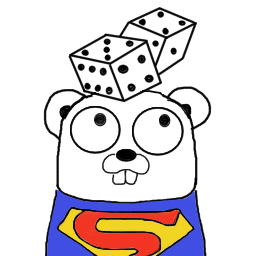

# BetaGo
 

This MIA bot uses superhuman-powers like infrared-vision to beat others.

Repository: [here](https://github.com/janernsting/maexchen) 

Protocol: [here](https://github.com/janernsting/maexchen/blob/master/protokoll.en.markdown)

## Get the BetaGo sources

Change your current directory to your Github repositories:

    cd $GOPATH/src/github.com

Now clone the BetaGo sources by using Git:

    git clone https://github.com/andygeiss/betago.git

## Build the BetaGo binary

Ensure that your GOPATH is set (not empty):

    echo $GOPATH

Run GNU make utility to test and compile the BetaGo binary:

    make

## Install the binary

The BetaGo binary will be copied into /usr/local/bin:

    make install

## Run BetaGo

Start the BetaGo binary from the current path:

    betago 1.0 (build 20171130165231)

    This MIA bot uses superhuman-powers like infrared-vision to beat others.

    Options:
    --addr string
            MIA server address (host:port)
    --name string
            MIA Bot name (default "BetaGo")

    Example:
        betago -addr 172.17.0.2:9000 -name betago

